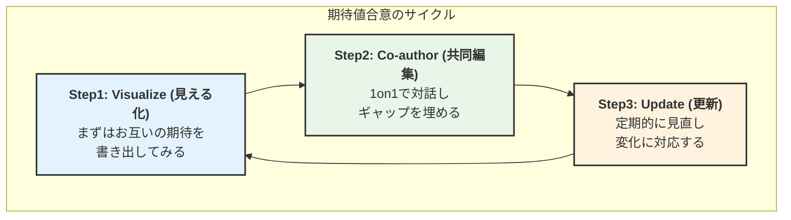

### デキるマネージャーは「評価」を待たない。チームを成功に導く『期待値合意』３つのステップ

半期に一度の評価面談。あなたは、この半年間の奮闘を胸に、自信を持って成果を語り始めた。
「チームが疲弊しないよう、非効率な業務プロセスを大幅に改善しました。来期、必ず成果に繋がります」

しかし、上司から返ってきたのは、予想もしない一言だった。
「プロセスの改善は、本当にありがとう。でもね、私が君に一番期待していたのは、何よりもまず**“今期の目標数字の達成”**だったんだよ」

***

場面は変わって、部下との1on1。
あなたは、メンバーの主体性を信じ、マイクロマネジメントを避けてきたつもりだった。
「最近どう？何か困っていることはない？」

すると、部下は意を決したように、こう切り出した。
「〇〇さん（あなた）が僕らを信頼して任せてくれているのは、本当に感謝しています。でも…正直、もう少し**“チームの進むべき方向性”**を明確に示してほしいんです。今、みんな自分がどこに向かって走っているのか分からず、少し不安で…」

良かれと思ってやったことが、ことごとく裏目に出る。
上司からは期待外れだと思われ、部下からは物足りないと感じられる。

もし、あなたがこの“静かなすれ違い”に少しでも心当たりがあるなら。
それは決して、あなたの能力が低いからではありません。

原因は、驚くほどシンプルです。
**あなたと上司、そして部下との間で、マネージャーとして何をすべきかという「期待値」が、致命的にズレてしまっている**。ただ、それだけなのです。

この記事では、その「ズレ」を解消し、あなたを正当に評価させ、チームを成功に導くための具体的なコミュニケーション術をご紹介します。

### 1. なぜ、あなたの頑張りは「期待外れ」に終わるのか？

現代のマネージャーは、かつてないほど複雑な役割を担っています。自身もプレイヤーとして成果を求められながら、多様なバックグラウンドを持つ部下を育成し、目まぐるしく変化する市場に対応しなければなりません。

かつてのように「背中を見て学べ」という暗黙の了解は、リモートワークが普及した現代ではもはや通用しません。**言葉にして伝えなければ、何も伝わらない**のです。

実際に、米Gallup社の調査によれば、「自分に求められていることが明確な従業員は、そうでない従業員に比べてエンゲージメントが2.8倍高い」というデータがあります。

期待値の明確化は、部下のエンゲージメントを高め、ひいてはチームの生産性向上や離職率の低下に直結する、まさに**“最強の武器”**なのです。

### 2. すれ違いを生む「3つの落とし穴」- あなたの職場は大丈夫？

では、なぜ私たちの職場では、これほどまでに期待値がズレてしまうのでしょうか。そこには、多くの組織が陥りがちな「3つの落とし穴」があります。

#### 落とし穴1：そもそも「期待値」が言語化されていない
経営層からの期待は「いい感じに、よろしく」。これでは、マネージャーは**目的地の知らされない船長**のようなものです。羅針盤も海図もないまま、とりあえず目の前の波を乗り越えるだけの航海になり、チームは漂流してしまいます。

#### 落とし穴2：「What（何を）」の合意だけで満足してしまう
目標数字（What）や納期（When）は明確でも、「How（どうやって）」の部分が抜け落ちているケースです。
これは、レストランで「美味しいパスタを作って」とだけ注文するようなものです。料理人は、オイル系なのか、トマト系なのか、はたまたクリーム系なのか分からず、最高の腕を振るえません。**「売上目標達成」という名のパスタ**も、その調理法（How）の合意がなければ、期待通りの味にはならないのです。

#### 落とし穴3：一度話して“終わり”になっている
期初の目標設定面談はするものの、その後は放置。ビジネス環境やチームの状況は刻一刻と変化しているのに、期待値だけが固定化されてしまっています。本来、軌道修正の場であるはずの1on1が、単なる「進捗確認」や「雑談」で終わっていませんか？

### 3. 期待値を「最強の武器」に変える、3ステップ合意形成術

これらの落とし穴を避け、期待値をズレをなくすための具体的な方法が**「3ステップ合意形成術」**です。

#### Step 1：見える化する（Visualize）
まずは、あなたと上司、それぞれが「マネージャーに期待すること」を書き出してみましょう。頭の中だけで考えず、文字に落とし込むことが重要です。後述の「期待値合意シート」のようなフレームワークを使うと、思考が整理しやすくなります。

#### Step 2：対話し、合意する（Co-author）
次に、お互いが書き出したものを見せ合いながら、1on1で対話します。
ここでのポイントは、「交渉」ではなく**「共同編集（Co-authoring）」**のスタンスで臨むこと。どちらか一方の意見を押し付けるのではなく、二人で理想の「マネージャー像」という一つの作品を創り上げるイメージです。

**【会話例】**
**上司:** 「（まず、相手の考えを受け止める）なるほど、〇〇さんは自分の役割をこう捉えているんだね。特に『チームの心理的安全性を高める』という点を重視しているのは、僕も大賛成だ。素晴らしい視点だと思う。
**（その上で、自分の期待を伝える）**その上で、一つ相談なんだけど、今期は特に『新規事業の成功確度を上げるためのプロセス構築』という点にも、もう少し時間とエネルギーを割いてほしいと考えているんだ。**（相手の意見を求める）**この点について、どう思う？」

#### Step 3：見直し、更新する（Update）
一度合意した期待値は「生もの」です。ビジネスの変化やチームの成長に合わせ、月次や四半期ごとの1on1で定期的に見直しましょう。「この期待値は、今の状況に合っているか？」と問いかけ、柔軟にアップデートしていくことが成功の鍵です。

### 4.【明日から使える】“期待値合意シート”と魔法のフレーズ集

#### 【テンプレート】期待値合意シート
*上司との1on1の前に、まずは自分自身の考えを整理するために活用してみてください。*

| 項目 | あなたの考えを記入してみましょう |
| :--- | :--- |
| **1. ミッション/役割** | Q. 私のチームが、組織全体の中で果たすべき最も重要な役割は何だと考えていますか？ |
| **2. 成果目標 (What)** | Q. 今期、必ず達成すべき「定量的」な目標と「定性的」な目標は何ですか？ |
| **3. 行動指針 (How)** | Q. 成果を出す上で、特にどのような行動や価値観を大切にすべきだと考えていますか？ (組織のバリューと紐づけて) |
| **4. 権限と裁量** | Q. どの範囲の意思決定まで、私自身に任されていると考えていますか？ 逆に、必ず相談すべきことは何ですか？ |
| **5. コミュニケーション** | Q. 上司であるあなたへ、どのような頻度・方法で報告・連絡・相談を行うのが理想的ですか？ |
| **6. 能力開発** | Q. 私がマネージャーとして、今後さらにどのようなスキルや能力を伸ばしていくことを期待していますか？ |

#### 魔法のフレーズ集
**マネージャーから上司へ：**
「次の1on1で、改めて私が期待されている役割について、認識を合わせる時間を30分ほどいただけませんか？」

**上司からマネージャーへ：**
「〇〇さんにもっと活躍してもらうために、私が期待していること、そして〇〇さんが挑戦したいことについて、一度じっくり話したいと思っています。」

### 5.「でも、それって…」- マネージャーが抱く“3つの不安”の解消法

#### Q1. 細かく期待値を伝えると、窮屈に感じさせませんか？
**A1.** その不安、とてもよく分かります。しかし、「マイクロマネジメント」と「期待値の明確化」は、似て非なるものです。
- **マイクロマネジメント**は、運転の**「一挙手一投足を指示する」**こと。
- **期待値の明確化**は、**「目的地と、進むべき方角を示すコンパスを渡す」**こと。
最高の走り方を知っているのは、ハンドルを握る本人です。私たちは、彼らが道に迷わないためのサポートをするだけなのです。

#### Q2. 上司からの期待と、部下からの期待が違う場合はどうすれば？
**A2.** 素晴らしい視点です。それこそが、マネージャーという仕事の醍醐味であり、最も難しい部分ですよね。
その際は、まず**両方の期待を「見える化」**しましょう。そして、上司との1on1でこう切り出すのです。
「今、部下からは『もっと明確な方向性を示してほしい』という期待を受けています。一方で、部長からは『今期の目標数字達成』を強く期待されています。この二つを両立させるために、例えば、目標達成に向けた戦略策定に、私とチームがもう少し時間を使えるよう、〇〇の業務についてサポートをいただくことは可能でしょうか？」
このように、部下からの期待を**「交渉の材料」**として使うのです。マネージャーは単なる中間管理職ではなく、組織の**「結節点」**であり、上下の期待を翻訳し、調整する**交渉者**でもあるのです。

#### Q3. 期待値を伝えても、相手がなかなか行動を変えてくれない…
**A3.** その場合、原因は「納得感の欠如」か「スキルの不足」のどちらかかもしれません。
まずは、なぜその期待が必要なのか（Why）を丁寧に伝え、本人のキャリアや成長とどう繋がるのかを一緒に考え、納得感を醸成しましょう。それでも行動が変わらない場合は、スキル不足の可能性があります。その際は、具体的な支援（研修、コーチング、OJTなど）を約束することが重要です。

### 6. 最後に：評価されるのを待つな。期待値をデザインせよ。

期待値の擦り合わせは、一度やれば終わる魔法の杖ではありません。それは、上司を、チームを、そして組織を動かすための、継続的な対話のプロセスそのものです。

もはや、年に一度の評価をただ待つ時代は終わりました。**デキるマネージャーは、評価を「もらう」のではなく、自ら「創り出す」のです。**

さあ、まずはこの記事を閉じて、小さな一歩を踏出しましょう。

1.  **ペンを取る：** 上司に期待されていると思うことを、3つだけ書き出す。
2.  **カレンダーを開く：** 次の1on1のアジェンダに、「期待値のすり合わせ」と書き加える。
3.  **合意を作る：** まずは「報告の頻度」など、本当に小さなテーマでいい。「これからはこうしませんか？」という、未来に向けた約束を一つだけ交わす。

その小さな約束が、あなたを「孤独な板挟み」から解放し、チームと組織を成功へと導く、最も確実で、最も力強い一歩となるはずです。

---

#マネジメント #リーダーシップ #管理職 #チームビルディング #1on1 #評価 #人材育成 #組織開発 #エンゲージメント #板挟み #仕事術 #コミュニケーション #キャリア #リーダーのnote #仕事の悩み
