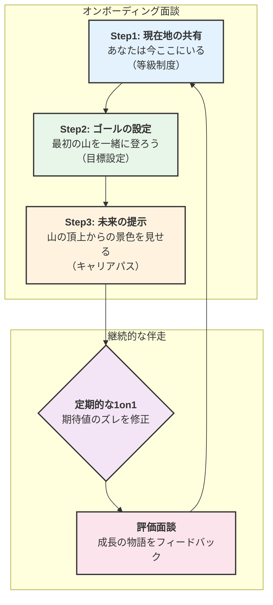

### もう「こんなはずじゃなかった」と言わせない。新人の即戦力化を加速する『期待の伝え方』３つのステップ

 

「鳴り物入りで入社した期待の新人。でも、3ヶ月経ってもパフォーマンスが思うように上がらない。1on1で話を聞いても『頑張ります』とは言うものの、どこか表情は硬いまま…」

「『とにかく吸収します！』と意欲的だったはずが、どうも頑張りの方向性がズレている。もっと主体的に動いてほしいのに、指示待ちの状態が続いている…」

マネジメントに携わる方なら、一度はこんな**「見えない壁」**に突き当たった経験があるのではないでしょうか。

そのもどかしさ、実は新人のスキルや意欲の問題ではなく、入社初日における**「期待の伝え方」という、たった一つのボタンの掛け違い**が原因かもしれません。

私たちは新メンバーに、会社のビジョンや事業内容は丁寧に説明します。しかし、「この組織で、あなたに、具体的にどうなってほしいのか」という**成長の地図とコンパス**を、明確な言葉で渡せているでしょうか？

曖昧な「頑張ってね！」は、時に新人を孤独な暗闇に迷わせ、「こんなはずじゃなかった」という早期離職の引き金にすらなります。

この記事では、そんな悲しいすれ違いをなくすため、会社の公式な"モノサシ"である「人事制度」を最強のコミュニケーションツールとして活用し、**新人のポテンシャルを最大限に引き出す「期待の伝え方」**を、明日からすぐに使える具体的な3つのステップで解説します。

この記事を読み終える頃には、あなたの会社のオンボーディングが、単なる業務説明ではなく、新人の未来を照らし、共に成長するための戦略的な対話の場へと変わるはずです。

### 給与を決めるだけじゃない。人事制度が「期待を伝える最強の武器」になる理由

「え、人事制度って、給与を決めるためのものじゃないの？」

そう思われるかもしれません。しかし、人事制度は本来、会社が社員に「何を」「どのように」頑張ってほしいかを伝えるための、公式なメッセージそのものです。

そう、人事制度とは、会社からメンバー一人ひとりへの期待を言語化した、いわば**「公式なラブレター」**なのです。

- **等級制度**は、「君のこんな素敵なところに惹かれているよ（＝評価している能力）」という**魅力の言語化**。
- **評価制度**は、「これから一緒にこんな関係を築いていきたいな（＝目指してほしいゴール）」という**未来への招待状**。

口頭での「頑張ってね！」という曖昧な激励を、誰もが納得できる「共通言語」に変換してくれる最強のコミュニケーションツールなのです。

特に、まだ社内の”暗黙の了解”がわからない新メンバーにとって、この「共通言語」で期待を伝えてもらえることは、安心感と具体的な行動指針に繋がります。

### 新人の未来を照らす、オンボーディング面談「3つのステップ」

では、具体的にどのように人事制度を使って期待を伝えれば良いのでしょうか。ここでは、入社後のオンボーディング面談を想定した3つのステップをご紹介します。

#### Step1:「あなたは今、ここにいる」- 等級制度で"現在地"を共有する

まず、新メンバーがどの「等級」で採用されたのか、その等級にはどのような役割や責任、行動が定義されているのかを、等級判定シートや等級定義書といったドキュメントを一緒に見ながら説明します。

**【会話例】**
「〇〇さん、今回の採用では当社の『G3』等級に格付けされています。これは会社からの**『最初の期待表明』**だと思って、まずは気軽に聞いてくださいね。この資料を一緒に見てもらえますか？ G3等級のメンバーには、主に『担当業務を自律的に遂行し、改善提案ができる』ことが期待されています。具体的には、この項目にある『課題発見力』や『関係者調整力』といった部分ですね。まずはこのG3の役割を完璧にこなすことを目指していきましょう。」

**＜ポイント＞**

- **ドキュメント化と口頭説明のバランス:** 資料を渡すだけでなく、必ず口頭で「あなた自身の言葉で」パーソナライズして伝えることが重要です。「〇〇さんのこれまでのご経験を、特にこの『課題発見力』の部分で活かしてほしいと思っています」のように、期待を個人に紐づけてあげましょう。
- **「見える化」する:** 抽象的な言葉で終わらせず、具体的な等級要件を指し示しながら話すことで、期待値が「見える化」され、認識のズレを防ぎます。

#### Step2:「最初の山を一緒に登ろう」- "等級要件"をコンパスに目標を決める

現在地がわかったら、次に最初の評価期間（例：3ヶ月後、半年後）のマイルストーンとなる「ミッション」や「目標」を設定します。

ここで重要なのは、いきなりSMARTの法則（Specific, Measurable, Achievable, Relevant, Time-bound）を持ち出すのではなく、Step1で確認した「等級要件」を基準にすることです。

**【NG例 👎】**
「とにかく頑張って、半年で売上目標1,000万円を達成してください！」
（これでは、何をどう頑張れば評価されるのかが不明確です。）

**【OK例 👍】**
「まず、G3等級の要件である『自律的な業務遂行』を発揮して、売上目標1,000万円を達成するミッションに挑戦しましょう。そのために、最初の3ヶ月は『既存顧客への深耕提案』という行動目標にフォーカスするのはどうでしょうか？これができれば、等級要件の『関係者調整力』も自然と身につくはずです。もちろん、これはあくまで**たたき台**です。〇〇さんの得意なやり方もぜひ聞かせてほしいです。一緒に最高のスタートダッシュを切りましょう。」

**＜ポイント＞**

- **成果と行動の両面を伝える:** 売上などの「成果目標（What）」だけでなく、等級要件に紐づく「行動目標（How）」もセットで期待を伝えます。これにより、成果が出なかった場合でも、プロセスや行動を評価・フィードバックすることができます。
- **あくまで「一緒に」決める:** トップダウンで目標を押し付けるのではなく、本人の意思や得意なことを引き出しながら、一緒にゴールを設定するプロセスが、当事者意識を高めます。

#### Step3:「山の頂上からの景色を見せる」- "未来の姿"を語り、成長意欲を灯す

ミッションや目標だけでなく、その先にある「成長」についても期待を伝えましょう。特に、バリュー（企業理念や行動指針）の体現や、リーダーシップの発揮といった、定性的な側面への期待は、本人の視座を高め、組織へのエンゲージメントを深めます。

**【会話例】**
「成果ももちろん重要ですが、私たちは〇〇さんが仕事を進める上で、当社のバリューである『挑戦を称える』を体現してくれることも同じくらい期待しています。失敗を恐れずに、新しい提案をどんどんしてくださいね。」
「もしこのG3等級のミッションを期待以上に達成できれば、次はG4等級への昇格が見えてきます。G4では、後輩指導など、少しリーダーシップの発揮も求められるようになります。そんな未来も楽しみにしています。もちろん、焦る必要は全くありません。まずは目の前のミッションを楽しみながら、**半年後の自分の成長した姿**を想像してみると、ワクワクしませんか？」

**＜ポイント＞**

- **昇格要件もセットで:** 今の等級の期待だけでなく、一つ上の等級の要件も少し見せてあげることで、「次はここを目指せばいいんだな」というキャリアパスが明確になり、成長意欲を刺激します。
- **バリューを具体的に:** 「バリューを大切に」と言うだけでなく、「あなたの〇〇という行動が、まさにうちのバリューだよ」と、具体的な行動に紐づけてフィードバックすることで、バリューが自分ごとになります。

### "期待"を"現実"に変える伴走術 - 1on1と評価面談でズレをなくす

入社時に期待を伝えたら、それで終わりではありません。むしろ、そこからがスタートです。定期的な振り返りを通じて、期待値のズレを修正し、成長をサポートしていく必要があります。

**1. 定期的な1on1での「期待の再チューニング」**
週に一度の1on1は、期待値を再調整する絶好の機会です。進捗確認だけでなく、以下の3つの問いを投げかけてみましょう。
- **「期待との一致」**: 「入社前に期待していた役割と、今やっている業務で、ポジティブなギャップはある？」
- **「困難の言語化」**: 「今、一番『見えない壁』に感じていることは何？」
- **「成長実感の確認」**: 「この1週間で、自分ができるようになったと感じることは？」

**2. 評価面談での「成長の物語化」**
3ヶ月後や半年後の評価面談は、単なる結果の通知の場ではありません。入社時に設定した「期待」に対して、本人がどのように挑戦し、成長したのかを**物語としてフィードバック**します。「期待通りだった点」「期待を大きく超えて素晴らしかった点」「もう少し期待に追いついてほしい点」などを、等級要件や目標シートに沿って客観的に伝えることが重要です。ここで認識のギャップがあれば、丁寧にすり合わせ、次のアクションを一緒に考えます。

### 最後に：すべての「すれ違い」は、期待の伝え方から始まる

新メンバーのポテンシャルという名の「宝箱」を開ける鍵は、特別な魔法ではありません。それは、入社初日に行う、**具体的で、誠実で、そして未来志向の「期待のコミュニケーション」**に他なりません。

人事制度は、そのための単なる管理ツールではなく、会社の価値観と個人の成長を繋ぎ、お互いの信頼関係を築くための強力な羅針盤です。

もし今、あなたのチームで新メンバーとの「見えない壁」を感じているなら、ぜひ一度、立ち止まって問いかけてみてください。

**「私たちは、彼らに成長の地図とコンパスを渡せているだろうか？」と。**

この記事が、その問いへの一つの答えとなり、あなたの会社のオンボーディングをアップデートする一助となれば、これほど嬉しいことはありません。

▼ぜひ、あなたの会社の実践例やご意見もコメントで教えてください！

---

### 【付録】明日から使える！オンボーディング面談セルフチェックリスト

*面談前に、ご自身の言葉でどう伝えるかシミュレーションしてみましょう。*

#### **□ Step1: 現在地の共有はできたか？**
- [ ] 等級制度の資料を使い、「あなたの現在地（等級）」を明確に示せたか？
- [ ] その等級に求められる役割や責任を、抽象的でなく具体的に説明できたか？
- [ ] **「あなたの〇〇という経験が、特にこの部分で活かせると期待しています」**と、個人への期待を伝えられたか？

#### **□ Step2: 最初のゴールの設定はできたか？**
- [ ] 最初の評価期間と、挑戦してほしいメインミッションを提示できたか？
- [ ] 等級要件をベースに、「成果（What）」と「行動（How）」の両面から目標を**一緒に**設定できたか？
- [ ] **「もし困ったら、いつでも相談してね」**と、心理的安全性を確保する一言を添えられたか？

#### **□ Step3: 未来の姿は語り合えたか？**
- [ ] 会社のバリューと紐づけて、仕事へのスタンスや行動への期待を伝えられたか？
- [ ] 一つ上の等級を示し、「こんな成長の道筋がある」という未来のキャリアパスを共有できたか？
- [ ] **「あなた自身は、今後どんなことに挑戦していきたい？」**と、本人のキャリア観を引き出せたか？

#### **□ 期待を現実にする仕組みは整えられたか？**
- [ ] 定期的な1on1の日程をその場で決めることができたか？
- [ ] チーム内のメンターや、気軽に質問できる相手を紹介できたか？
- [ ] **「では、次の1on1までに、まず何から始めようか？」**と、具体的な次の一歩（アクションプラン）を握れたか？

---

#人事 #マネジメント #オンボーディング #1on1 #人事制度 #目標設定 #早期離職 #ミスマッチ #新人育成 #人材育成 #組織開発 #仕事のコツ #リーダーシップ #チームビルディング #キャリア #働きがい
