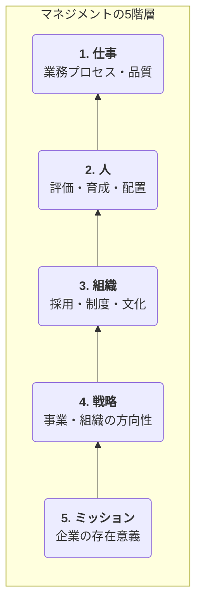

### 社長、その仕事まだ自分でやってるんですか？ 事業をスケールさせる「権限移譲」の教科書

#### はじめに：あなたは「スーパーマン」から「指揮者」へ

朝7時の役員会から深夜のメール返信まで、文字通り24時間、会社のことを考え続けている。誰よりも働き、誰よりも事業を愛している自負がある。

なのに、なぜだろう。

売上の伸びは鈍化し、有望な若手からは「もっと裁量権がほしい」という声が聞こえ始め、自分が休むと途端に現場の意思決定が止まる。

もし、あなたがそんな**「自分がボトルネックになっている」**という焦りを感じているなら。
その原因は、あなたが優秀すぎるからかもしれません。

創業期、あなたは文字通り**「スーパーマン」**でした。一人で何役もこなし、圧倒的な馬力で事業を牽引してきた。しかし、組織が成長し、新たな才能が集まってきた今も、同じプレースタイルを続けていませんか？

この記事は、そんな孤独なスーパーマンから、**多様な才能が奏でる最高のハーモニーを創り出す「指揮者」**へと、あなたが進化するための変革の書です。

事業を次のステージへスケールさせるための経営戦略、『権限移譲』。その本質と、明日から使える具体的な技術を、数々の失敗談と成功事例を交えながら、余すことなくお伝えします。

---

### 1. 「任せる」のは“abandonment（放棄）”ではない。“strategy（戦略）”である

多くの経営者が「権限移譲」という言葉に、一抹の不安や、仕事を「手放す」ことへの抵抗を感じます。しかし、権限移譲は単なる「仕事の割り振り」や「丸投げ」といった業務放棄ではありません。それは、**会社の未来を創るための、極めて高度な経営戦略**です。正しく実行された権限移譲は、組織に3つの豊潤な果実をもたらします。

- **① 経営者の時間創出:** あなたの時間は、会社にとって最も希少な資源です。権限移譲によって、あなたは「あなたにしかできない仕事」――すなわち、未来の事業の種を蒔き、育てる仕事に集中できるようになります。
- **② 次世代リーダーの育成:** 人は、責任ある仕事を任されて初めて当事者意識を持ち、成長します。権限移譲は、座学研修を100時間行うよりも雄弁に、未来の経営幹部を育てる最高の育成プログラムです。
- **③ 組織能力の最大化:** 意思決定のスピードは、現代のビジネスにおいて競争優位そのものです。現場に近いメンバーが迅速に判断を下せる組織は、変化に強く、しなやかな成長を遂げることができます。

---

### 2. すべてを任せるな。社長にしか描けない「未来の地図」とは

権限移譲を「戦略」として機能させるためには、まず**「絶対に手放してはならない経営の聖域」**を定義する必要があります。それこそが、社長にしか果たせない中核業務です。

- **① 未来を描くコンパス：ビジョン・ミッションの策定と浸透**
  「我々は何のために存在し、どこへ向かうのか？」という組織の根幹を示す北極星。これを描き、語り続け、組織の隅々にまで浸透させることは、経営者最大の責務です。

- **② 組織の“空気”を創る：企業文化の醸成と体現**
  どんな価値観を大切にし、何を良しとし、何を許さないのか。企業文化は、日々の無数の意思決定の土台となります。社長自らがその文化の伝道師であり、体現者であり続ける必要があります。

- **③ 最終的な存続責任：重大な経営判断と資金に関する意思決定**
  会社の存続を揺るがすような重大なリスク判断、大型の資金調達やM&Aといった、最終的なハンコを押す責任は、誰にも移譲できません。

これら3つの聖域を自覚してはじめて、我々は何を手放すべきかを見極めることができるのです。

---

### 3.【実践ワーク】あなたの“仕事”を棚卸しする

「手放すべき」と頭で分かっていても、何から手をつければいいか分からない。それが本音でしょう。ここでは、あなたの仕事を分解し、移譲すべき領域を発見するための2つの思考ツールをご紹介します。

#### 3-1. マネジメントの5階層で考える移譲のステップ

組織のマネジメントは、以下の5つの階層に分解できます。あなたの会社は今、どの階層のマネジメントを誰が担っていますか？


- **創業期:** 社長が1から5の全てを担います。
- **拡大初期:** まずは現場リーダーへ**「1. 仕事のマネジメント」**から移譲を開始します。業務プロセスや品質管理を任せることで、社長は少しずつ現場から離れる準備をします。
- **組織化期:** 次にマネージャーを任命し、**「2. 人のマネジメント」**や**「3. 組織のマネジメント」**を段階的に移譲していきます。

あなたの会社のフェーズに合わせて、まずは「仕事のマネジメント」領域に、移譲できる業務がないか探してみましょう。

#### 3-2. 「移譲すべき業務」発見チェックリスト
- [ ] 日常的な業務運営（進捗管理、定例報告）
- [ ] チーム単位の目標設定と評価
- [ ] 採用面接（一次・二次）
- [ ] 特定プロジェクトの推進責任者
- [ ] 現場レベルでの顧客対応やクレーム判断
- [ ] 社内の部門間調整

---

### 4. “How to Delegate” - 失敗確率を劇的に下げる2つのフレームワーク

移譲する業務を決めたら、次は「どう任せるか」です。ここを間違えると、悲劇が起こります。失敗を防ぐための、2つの実践的フレームワークをご紹介します。

#### 4-1. 移譲レベルを見極める：「任せ方」の5段階

相手のスキルと意欲を見極め、適切なレベルで任せることが成功の鍵です。

- **Level 1: 調べて報告して。**（指示待ちレベル）
- **Level 2: 選択肢を考えて持ってきて。**
- **Level 3: 「こうしようと思う」と提案して。**
- **Level 4: 実行して、都度報告して。**
- **Level 5: 完全に任せる。結果だけ報告して。**（最終ゴール）

いきなりレベル5を目指すのではなく、相手の成長に合わせて少しずつレベルを上げていくことが、育成の観点からも重要です。

#### 4-2. タスクを仕分ける：「重要度・緊急度マトリクス」応用編

あなたのタスクをこの4象限に仕分け、どこから手放すべきかを考えます。

```mermaid
graph TD
    subgraph 重要度・緊急度マトリクス
        A("<b>A. 重要 × 緊急</b><br>（自分がやるべき仕事）<br>危機対応、重大な意思決定")
        B("<b>B. 重要 × 緊急でない</b><br>（最も時間をかけるべき仕事）<br>戦略策定、仕組み作り、採用")
        C("<b>C. 重要でない × 緊急</b><br>（積極的に移譲すべき仕事）<br>多くの日常業務、定例会議")
        D("<b>D. 重要でない × 緊急でない</b><br>（やめるべき仕事）<br>非生産的な活動")
    end
```

多くの経営者が「A」の領域に追われ、「B」の領域に時間を割けていません。**「C」の領域の仕事を積極的に手放すこと**が、未来を創る「B」の時間を確保するための第一歩です。

---

### 5. 7割の権限移譲は失敗する。あなたがハマる“4つの罠”と、その抜け出し方

残念ながら、多くの権限移譲は失敗に終わります。ここでは、経営者が陥りがちな4つの罠と、その処方箋を解説します。

- **罠①：「結局、俺がやる病」**
  任せたはずの仕事に細かく口を出し、結局自分でやってしまう。これはメンバーのやる気を削ぐ最悪のマイクロマネジメントです。
  - **処方箋:** 任せる前に**「期待値」**をすり合わせましょう。ゴール、判断基準、報告方法などを明確に合意すれば、プロセスに口を出す必要はなくなります。

- **罠②：「恐怖の丸投げ」**
  目的や背景を伝えずに、ただ仕事を放り投げる。メンバーは混乱し、最悪の場合、重大な失敗を招きます。
  - **処方箋:** 権限と**「情報」**をセットで渡しましょう。判断に必要な情報（予算、関連データ、過去の経緯など）をオープンにすることで、メンバーは自律的に動けるようになります。

- **罠③：「優秀な人、辞めちゃう問題」**
  マイクロマネジメントとは逆に、優秀なメンバーにいつまでも権限を渡さず、成長機会を奪ってしまう。意欲の高い人ほど、見切りをつけて去っていきます。
  - **処方箋:** 移譲レベルを意識的に引き上げましょう。小さな成功体験を積ませ、徐々に大きな裁量権を与えることで、成長意欲に応えることができます。

- **罠④：「サイロ化と責任のなすりつけ合い」**
  部門長に権限を移譲した結果、部門間の連携が失われ、問題が起きると責任を押し付け合う。
  - **処方箋:** **「失敗を許容する文化」**を創りましょう。「任せた仕事の最終責任は、常に社長である自分が取る」という覚悟を示し、挑戦した結果の失敗を責めない文化を醸成することが、部門間の壁を壊します。

---

### 6. 最後に：スーパーマンの「マント」を脱ぐとき

権限移譲は、単なる経営テクニックではありません。
それは、これまで一人で背負ってきた重荷を手放し、メンバー一人ひとりの可能性を心から信じるという、**経営者自身の「器」が試される、成長のプロセス**です。

あなたが手放した仕事の先に、メンバーの劇的な成長と、事業の新たなステージが待っています。

スーパーマンのマントを脱ぎ、タクトを握る準備はできましたか？

まずは明日、あなたのタスクリストの中から、たった一つでも「手放せる仕事」を見つけることから、その壮大な交響曲を始めてみませんか。

---

#経営 #権限移譲 #マネジメント #リーダーシップ #組織開発 #スタートアップ #事業承継 #社長の仕事 #チームビルディング
