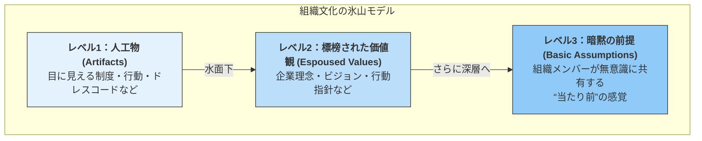

### 降格・降給は、「制度」でなく『カルチャー』である。

#### はじめに：あなたの会社の「降格制度」は、なぜ機能しないのか？

「降格」「降給」——。

この言葉に、どのような響きを感じるでしょうか。
多くの経営者やマネージャーにとって、それはできれば避けたい、重く、気まずい響きかもしれません。

あなたの会社の就業規則にも、おそらく「降格・降給」に関する条文は眠っているはずです。しかし、それが実際に機能している場面を、あなたはどれだけ目にしてきたでしょうか。

多くの組織で、降格制度は**「存在するが、使われない」都市伝説**と化しています。
なぜなら、短期的に見れば、波風を立てずに現状を維持する方が、圧倒的に「楽」だからです。

しかし、もしその「楽」な選択が、あなたの組織の健全な新陳代謝を阻害し、本当に報われるべき社員の意欲を静かに削いでいるとしたら？

この記事は、単なる人事制度の運用ノウハウを解説するものではありません。
降格・降給という、組織の「痛み」を伴う行為をあえて見つめ直し、それを**フェアで健全な成長を促す『カルチャー』へと昇華させる**ための、思考のフレームワークを提示するものです。

これは、あなたの組織の「あるべき姿」を問う、リーダーのための物語です。

---

### 1. なぜ、あなたの会社の降格制度は「都市伝説」と化すのか？

多くの企業で降格制度が形骸化する背景には、構造的な問題が存在します。

- **マネージャーの心理的負担:** 降格を言い渡す行為は、部下との深刻な対立を生みかねません。短期的なチームの和を考えれば、見て見ぬふりをする方が合理的だと感じてしまうのです。
- **評価基準の曖昧さ:** 何をもって「降格に値する」とするのか。明確で公正な基準がなければ、不公平感の温床となり、最悪の場合、法的なリスクにも発展します。
- **インセンティブの欠如:** 制度を厳格に運用したからといって、マネージャー自身の評価が直接的に上がるわけではないため、困難な道を選ぶ動機が働きにくいのです。

しかし、変化の激しい成長企業では、事業フェーズの変化や役割の変更に伴い、降格・降給も**「組織のダイナミズムの一部」**として捉えられています。役割（Role）と成果（Result）、そして報酬（Reward）を常に一致させようとする健全な緊張感が、組織の成長をドライブしているのです。

---

### 2. 「制度」が「カルチャー」に変わる時 - 組織文化の深層構造

では、どうすれば降格・降給を「ただのルール」から「組織の当たり前」に変えられるのでしょうか。ここで、組織文化の大家、エドガー・シャインの「組織文化の三層構造」を紐解いてみましょう。

就業規則に書かれた降格制度は、目に見える「レベル1：人工物」にすぎません。理念として「フェアな評価」を掲げても、それは「レベル2：標榜された価値観」です。これらが**「レベル3：暗黙の前提」**、すなわち**「この組織では、役割と成果に応じて待遇が変わるのが当然だ」**と、社員が無意識レベルで納得して初めて、降格・降給はカルチャーとして機能します。

そして、この「暗黙の前提」を創り出す唯一の方法は、**リーダーの一貫した行動**です。短期的な人間関係の摩擦を恐れず、「会社の価値観に反する行動」や「役割に見合わない成果」に対し、トップ自らが毅然とした判断を下し続ける。そのブレない姿勢こそが、組織の「当たり前」を創り上げるのです。

---

### 3. 「恐怖政治」にしないための“公正”な仕組みづくり

もちろん、ただ厳格に制度を運用するだけでは、社員が萎縮する「恐怖政治」に陥ります。カルチャーとして根付かせるには、社員の納得感を担保する**「手続き的公正（Procedural Justice）」**の設計が不可欠です。

- **① 降格アラート:**
  いきなり降格を言い渡すのではなく、「このままでは降格の可能性がある」と事前に通告します。その際、降格を回避するための具体的な改善要件を明示し、**本人に反論と改善の機会**を与えます。一方的な通告は、最も納得感を損ないます。

- **② 調整給（激変緩和措置）:**
  降格に伴う給与の急激な減少は、社員の生活を脅かします。一定期間（例：3ヶ月〜半年）、差額の一部を補填する「調整給」を支給することで、ソフトランディングを促し、**再挑戦への意欲**を繋ぎ止めます。

- **③ 中間評価と高頻度の1on1:**
  年に一度の評価では、認識のズレが致命的になります。定期的な1on1や中間評価の場で、期待値と現状についてこまめにすり合わせを行うことが、最終評価への納得感を劇的に高めます。

これらの制度の目的は、社員を罰することではありません。「人件費の適正化」と「成果の安定化」を通じて、**組織全体の健全性を高める**ことにあります。

---

### 4. 降格・降給がもたらす光と影 - 組織が払うべき「健全なコスト」

このカルチャーを根付かせることは、組織に光と影、両方の側面をもたらします。リーダーは、その両方を直視する覚悟が必要です。

#### ポジティブな影響（光）✨
- **フェアネスの実現:** 貢献度に基づいた公正な報酬体系が実現し、評価制度への信頼が高まります。
- **ハイパフォーマンス文化の醸成:** 成果を出した社員が正当に報われる文化が、全体のパフォーマンスを引き上げます。
- **組織の新陳代謝:** 常に最適な人員配置で事業を進めることができ、組織の競争力が維持されます。

#### ネガティブな影響（影）😥
- **心理的安全性の低下リスク:** 「失敗＝降格」という恐怖が、挑戦的な行動を抑制する可能性があります。
- **モチベーションの喪失:** 降格を経験した社員が、自信を失いエンゲージメントが低下するリスク。
- **優秀な人材の離職:** 安定や寛容さを求める人材にとっては、魅力的な環境とは言えないかもしれません。

ここで重要なのは、**「ぬるま湯の心理的安全性」と「健全な緊張感を伴う心理的安全性」を区別すること**です。真の心理的安全性とは、「何を言っても許される」状態ではなく、「人格を否定されることなく、健全な意見の対立や挑戦、そして失敗が許される」状態を指します。降格・降給の運用は、この「健全な緊張感」を組織に実装する行為とも言えるのです。

---

### 5. カルチャーとして定着させるための「3つの覚悟」

この挑戦的なカルチャーを定着させるには、リーダーの3つの覚悟が不可欠です。

- **① 経営陣の率先垂範と覚悟:**
  経営陣自らがこのカルチャーを体現し、一貫したメッセージを発信し続けること。「聖域なき評価」を自らに課す覚悟がなければ、社員はついてきません。

- **② 現場マネージャーの納得感醸成:**
  制度を実際に運用するマネージャー達が、その目的と意義を深く理解し、納得していること。彼らが部下に語る言葉にこそ、カルチャーが宿ります。

- **③ 人事制度と日常行動の整合性:**
  制度が立派でも、日々の1on1でのフィードバックが曖昧だったり、評価と関係ないところで物事が決まっていては意味がありません。制度と、現場で交わされる会話の「ノリ」が一致して初めて、カルチャーは浸透します。

---

### 最後に：あなたの組織は、何を「当たり前」とするのか？

降格・降給を、就業規則に眠らせておくか。
それとも、フェアな競争と成長を促すカルチャーの心臓部として、組織に実装するか。

その選択は、あなたの組織が**「何を大切にし、何を許さない組織なのか」**という根源的な問いに直結します。

それは、短期的な調和を優先する文化でしょうか？
それとも、痛みを伴ってでも、長期的な公正さと成長を追求する文化でしょうか？

そこに、唯一の正解はありません。

しかし、リーダーであるあなたには、その問いに向き合い、**自社の「正しいカルチャー」を定義し、体現し続ける**責任があります。

あなたの組織の「当たり前」は、本当に、今のままで良いのでしょうか。

---

#人事制度 #組織文化 #カルチャー #マネジメント #リーダーシップ #経営 #組織開発 #降格 #評価制度 #スタートアップ
